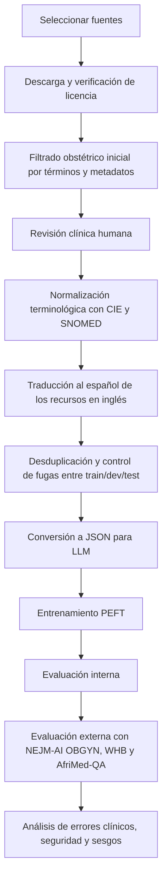

# Datasets QA en obstetricia para fine-tuning de LLM médicos en español

## Resumen ejecutivo

La conclusión principal es clara: **no he encontrado un dataset público, abierto, bien documentado y exclusivamente de QA obstétrico en español** que hoy pueda tomarse “tal cual” para un experimento serio de fine-tuning. Lo que sí existe es una combinación bastante sólida de recursos que permite construir un corpus competitivo: **un ancla en español** con preguntas médicas oficiales (principalmente urlCareQAturn7view0), **un ancla verdaderamente obstétrica/materna** aunque en inglés (urlMOTHERturn13view0 y su urlDataverse oficialhttps://doi.org/10.7910/DVN/EZLCH3), y **un ancla de escala** con QA médico-consumidor de alta calidad y licencia clara (urlMedQuADturn26view2). Para evaluación externa, los mejores candidatos son el examen de obstetricia y ginecología del benchmark urlNEJM-AI Q&A Benchmarkturn19view0, el subconjunto abierto de urlWomen’s Health Benchmarkturn24view0 y el subconjunto OBGYN de urlAfriMed-QAturn9view0. citeturn13view0turn35view3turn26view2turn20view0turn24view0turn9view1turn4view0

Si el objetivo es publicar o exponer en conferencia, **la estrategia metodológicamente más fuerte** no es buscar un único dataset “perfecto”, sino construir un **mixto curado** con tres capas:  
**capas de entrenamiento**: (a) subconjunto obstétrico en español de CareQA; (b) MOTHER traducido a español y revisado clínicamente; (c) slice obstétrico de MedQuAD como refuerzo de cobertura;  
**capas de evaluación**: (d) examen OBGYN de NEJM-AI; (e) WHB subset para errores críticos y urgencias; (f) si queréis medir generalización internacional, subconjunto OBGYN de AfriMed-QA. citeturn35view3turn13view0turn26view2turn20view0turn24view0turn9view1turn4view0

También hay una segunda conclusión importante: en español sí hay **ecosistema obstétrico útil**, pero muchas veces está en forma de **guías clínicas, revistas y recursos terminológicos**, no en forma de dataset QA listo para entrenar. En particular, entity["organization","GuíaSalud","Spanish National Health System clinical guidelines portal"], la urlRevista Colombiana de Obstetricia y Ginecologíaturn38search0, entity["organization","World Health Organization","UN specialized agency for health"] con la urlCIE-11 en españolturn39search0, y la edición española de urlSNOMED CTturn39search1 son los mejores complementos para traducir, normalizar y verificar vocabulario clínico. citeturn41search9turn38search6turn39search0turn39search1turn39search13

## Panorama de datasets priorizados

### Tabla comparativa de alto nivel

| Prioridad | Dataset | Foco obstétrico | Idioma | Tamaño útil | Formato | Licencia / acceso | Papel recomendado |
|---|---|---:|---|---:|---|---|---|
| Alta | MOTHER | Alto, maternal/pregnancy/postpartum | Inglés | 503 QA | JSON + CSV + estructura intents/patterns/responses | CC BY 4.0; acceso abierto vía artículo y Dataverse | Entrenamiento in-domain tras traducción y revisión clínica |
| Alta | CareQA obstetric slice | Medio; obstetricia mezclada dentro de medicina FSE | Español original + inglés traducido | 5.621 MCQ cerradas + 2.769 abiertas en total; el slice obstétrico hay que filtrarlo | HF dataset tabular | Apache-2.0; acceso abierto | Ancla principal en español |
| Alta | MedQuAD obstetric slice | Medio; gran colección médica general filtrable por embarazo/preeclampsia/lactancia, etc. | Inglés | 47.457 QA totales | XML | CC BY 4.0; con 3 subconjuntos sin respuestas por copyright de MedlinePlus | Escala y cobertura |
| Media | MASH-QA obstetric slice | Medio; consumer health, respuestas largas | Inglés | 34.808 QA totales; 9.519 multi-span | Dataset descargable + repo | Apache-2.0; enlace Drive desde repo | Útil si queréis QA largo o RAG-eval |
| Media | AfriMed-QA OBGYN subset | Medio-alto; OBGYN explícito | Inglés | 660 MCQ + 37 SAQ en el subconjunto OBGYN; 15.275 QA en el benchmark total | HF / benchmark | CC-BY-NC-SA 4.0 | Evaluación externa o refuerzo secundario |
| Media | NEJM-AI OBGYN exam | Alto pero pequeño | Inglés | 139 MCQ | CSV / HF | Licencia no visible de forma clara en la página de descarga; revisar antes de redistribuir | Test externo de nivel board |
| Media | Women’s Health Benchmark subset | Alto en seguridad y errores críticos, pero muy pequeño | Inglés | 20 prompts abiertos en el subset público; 96 casos en el benchmark completo | JSON | CC-BY-SA-4.0 | Stress test clínico, no entrenamiento |
| Baja-media | Pregnant Questions | Alto en pragmática materna, no tanto en volumen para FT | Inglés | 500 preguntas y 2.727 inferencias pragmáticas | Dataset no enlazado claramente en la página del paper | Acceso público al paper, pero enlace del dataset no queda claro | Fuente conceptual / posible evaluación cualitativa |
| Baja-media | HEAD-QA obstetric slice | Bajo-medio; español sanitario, pero no obstetricia explícita | Español + inglés | 6.765 preguntas totales | HF / ficheros descargables | MIT | Recurso español complementario, requiere filtrado manual |

Fuentes: MOTHER citeturn13view0turn15search2; CareQA citeturn35view3turn7view0; MedQuAD citeturn26view2; MASH-QA citeturn29view0turn26view3; AfriMed-QA y subconjunto OBGYN citeturn9view1turn4view0; NEJM-AI citeturn19view0turn20view0; WHB citeturn23view0turn24view0; Pregnant Questions citeturn16view0; HEAD-QA citeturn37view0turn7view2

### Lo que esta tabla significa en la práctica

Si priorizas **idioma español**, el mejor punto de partida es urlCareQAturn7view0, porque procede de exámenes oficiales FSE de entity["country","Spain","European country"], fue revisado manualmente, incluye versión cerrada y abierta, y tiene licencia Apache-2.0. Su debilidad es que **no viene etiquetado como obstetricia**, así que tendréis que construir ese subconjunto vosotros. citeturn35view3turn7view0

Si priorizas **especialidad obstétrica real**, el mejor recurso abierto es urlMOTHERturn13view0: 503 pares QA recogidos de mujeres embarazadas en Uganda, validados por personal médico, con ética aprobada y ficheros JSON/CSV listos para reutilización. Su debilidad es doble: está en inglés y el tamaño es pequeño para un FT serio si se usa solo. citeturn13view0turn15search2

Si priorizas **escala**, el mejor complemento es urlMedQuADturn26view2: 47.457 QA extraídos de 12 webs de los NIH, con tipos de pregunta, foco, sinónimos y UMLS CUI. No es obstetricia pura, pero es fácil construir un slice obstétrico filtrando por embarazo, puerperio, lactancia, preeclampsia, placenta, diabetes gestacional, etc. citeturn26view2

## Perfiles analíticos de los candidatos más útiles

### urlMOTHERturn13view0

**Origen y contenido.** El artículo describe un dataset de 503 pares de pregunta-respuesta sobre salud materna, recogidos a partir de desafíos reportados por mujeres embarazadas de primer, segundo y tercer trimestre en un entorno rural y semiurbano de entity["country","Uganda","East African country"]. Las respuestas fueron proporcionadas y validadas por personal médico. El corpus cubre cuidado prenatal, nutrición, complicaciones del embarazo, parto, posparto y bienestar materno. citeturn13view0

**Formato y acceso.** El trabajo indica depósito en Harvard Dataverse, y el propio artículo explica una estructura con pares QA y variantes más estructuradas de `intents`, `patterns`, `responses`, `tags` y `contexts`, además de ficheros JSON y CSV. La licencia del artículo es CC BY 4.0. citeturn13view0turn15search2

**Ejemplo de utilidad para FT.** Es excelente para convertir preguntas paciente→respuesta clínica breve, por ejemplo:  
entrada: “Tengo ardor, náuseas y no sé si es normal en el embarazo”;  
salida: respuesta breve, segura, con consejo de autocuidado y criterios de alarma.  
Ese estilo encaja muy bien con LoRA o adapters orientados a QA conversacional. La limitación es el tamaño: por sí solo, MOTHER es mejor como **núcleo especializado** que como único dataset de entrenamiento. citeturn13view0turn15search2

**Idoneidad.**  
Calidad de anotación: alta, porque las respuestas están validadas clínicamente.  
Cobertura: buena para embarazo y posparto básico, menor para obstetricia hospitalaria compleja.  
Balance: no documentado formalmente.  
Anonimización: al provenir de encuesta y no de EHR, el riesgo de PHI es mucho menor; aun así, el artículo no describe un protocolo de anonimización por registro, sino aprobación ética y consentimiento. citeturn13view0

### urlCareQAturn7view0

**Origen y contenido.** CareQA procede de exámenes FSE oficiales de 2020–2024 de biología, química, medicina, enfermería, farmacia y psicología. Soporta QA cerrada y abierta; el original cerrado está en español y la traducción al inglés se generó con GPT-4, mientras que la variante abierta se reescribió y validó humanamente. citeturn7view0turn35view3

**Tamaño y estructura.** El dataset declara 5.621 muestras cerradas y 2.769 abiertas; la categoría de medicina tiene 857 preguntas cerradas y 373 abiertas. Los campos incluyen pregunta, opciones, opción correcta, año, categoría e identificador único. Está concebido como benchmark de evaluación y no trae split train/dev/test. citeturn35view3

**Por qué importa aquí.** Aunque no sea “obstetricia pura”, sí contiene preguntas obstétricas claras dentro de medicina, por ejemplo sobre placenta previa, restricción del crecimiento intrauterino, Doppler umbilical o momento de finalización del embarazo. Eso lo convierte en el **mejor punto de apoyo en español** que he encontrado. citeturn35view3

**Idoneidad.**  
Calidad de anotación: alta, porque el origen son exámenes oficiales y el dataset fue revisado manualmente.  
Cobertura clínica: amplia, pero no especializada; obstetricia es una fracción del conjunto.  
Balance: documentado por categoría y año a nivel global, no a nivel obstétrico.  
Anonimización: no aplica, porque no hay datos de pacientes.  
Riesgo principal: si filtráis por keywords sin validación clínica, meteréis ruido de ginecología, pediatría neonatal o medicina general. citeturn35view3turn7view0

### urlMedQuADturn26view2

**Origen y contenido.** MedQuAD reúne 47.457 pares QA creados a partir de 12 webs de los NIH, con 37 tipos de pregunta y anotaciones adicionales de foco, sinónimos, CUI UMLS y tipo semántico. citeturn26view2

**Ventaja estratégica.** Para un proyecto de obstetricia, MedQuAD no es la pieza central, sino la **pieza de escala**. Su fortaleza es que os permite generar un slice obstétrico robusto filtrando por entidades y términos como `pregnancy`, `prenatal`, `postpartum`, `breastfeeding`, `preeclampsia`, `gestational diabetes`, `placenta previa`, `labor`, `delivery`, etc. Además, al traer metadatos semánticos, permite un filtrado mucho más limpio que el simple scraping textual. citeturn26view2

**Caveat legal importante.** El repositorio indica que retiraron respuestas en tres subconjuntos para respetar copyright de MedlinePlus. Esto es justamente el tipo de detalle que lo hace apto para un trabajo serio: podéis usar el dataset, pero debéis excluir o reconstruir con cuidado las partes donde no venga respuesta redistribuible. citeturn26view2

**Idoneidad.**  
Calidad de anotación: alta para consumer QA curado desde fuentes NIH.  
Cobertura obstétrica: depende del filtrado; en bruto es generalista.  
Balance: no documentado específicamente para obstetricia.  
Anonimización: no aplica, no hay EHR ni PHI.  
Valor añadido: ideal para aumentar tamaño sin perder trazabilidad semántica. citeturn26view2

### urlMASH-QAturn26view3

**Origen y contenido.** MASH-QA fue diseñado para respuestas largas y multi-span en consumer health. El paper reporta 34.808 pares QA, de los que 25.289 son single-span y 9.519 multi-span. Las preguntas provienen de WebMD y las respuestas se apoyan en artículos largos. El repositorio tiene licencia Apache-2.0 y enlaza la descarga del dataset. citeturn29view0turn26view3

**Cuándo usarlo.** Si vuestro FT va a responder con textos algo más elaborados o si queréis una versión RAG-aware, MASH-QA es muy valioso. Si, en cambio, buscáis respuestas breves estilo paciente-clínico, MedQuAD suele ser más fácil de convertir. citeturn29view0turn26view3

**Idoneidad.**  
Calidad de anotación: razonablemente alta, porque las respuestas se vinculan a artículos expertos.  
Cobertura obstétrica: requiere slice temático.  
Balance: la propia publicación sí distingue single-span y multi-span, lo que ayuda a diseñar subconjuntos equilibrados.  
Anonimización: no aplica. citeturn29view0

### urlAfriMed-QAturn9view0 y evaluación OBGYN

**Origen y contenido.** AfriMed-QA se presenta como benchmark pan-africano de 15.275 preguntas y respuestas en inglés, con 4.269 preguntas expertas, 11.006 crowdsourced/consumer y 32 especialidades, incluyendo Obstetrics & Gynecology. El paper indica licencia CC-BY-NC-SA 4.0 y publicación en Hugging Face. Un repositorio de extracción OBGYN reporta 660 MCQ y 37 SAQ para ese subconjunto. citeturn9view1turn9view0turn4view0

**Uso recomendado.** No lo usaría como corpus principal si el objetivo es español obstétrico, pero sí como **test externo** o como fuente complementaria para robustez cultural y clínica fuera del contexto español-estadounidense. citeturn9view1turn4view0

### urlNEJM-AI Q&A Benchmarkturn19view0 y urlWomen’s Health Benchmark subsetturn24view0

El benchmark de NEJM-AI ofrece cinco exámenes de residencia, entre ellos OBGYN, y la página de descarga muestra 139 preguntas para ese examen. Es muy bueno para medir desempeño tipo board exam, pero demasiado pequeño y demasiado “test-like” para ser el centro del entrenamiento. citeturn19view0turn20view0

El WHB subset contiene 20 casos representativos derivados de un benchmark mayor de 96 casos validados en salud de la mujer, con error categories clínicas importantes. Es excelente para evaluación de seguridad, urgencia, sesgos y recomendaciones desactualizadas, no para FT. citeturn23view0turn24view0

## Alternativas complementarias y recursos semánticos

### Datasets médicos generales que sí merece la pena tener en el radar

urlPubMedQAturn26view1 es útil si queréis evaluar preguntas de investigación biomédica con salida `yes/no/maybe`; tiene 1.000 ejemplos anotados por expertos, 61,2k no anotados y 211,3k generados artificialmente. Es muy valioso para razonamiento biomédico, pero está lejos del estilo paciente-obstetricia. citeturn26view1turn25search16

urlMedMCQAturn26view0 es enorme, con más de 194k MCQ de 21 materias médicas. Puede servir como preadaptación o como pool de preguntas OBGYN si usáis una extracción ya curada, pero para vuestro caso tiene peor alineación lingüística que CareQA y peor alineación temática que MOTHER. citeturn26view0turn4view0

urlHEAD-QAturn7view2 es valioso como complemento español: 6.765 preguntas de 2013–2017 en seis dominios sanitarios. Igual que CareQA, necesita filtrado manual para obstetricia. citeturn37view0turn7view2

urlHealthSearchQAturn25search3 incorpora 3.173 preguntas médicas de búsqueda real de consumidores y es muy útil como referencia para estilo de pregunta del paciente, aunque no está centrado en obstetricia. citeturn30search0turn25search3

### Casos clínicos, guías y corpus en español para augmentación

Para **crear QA sintético o weakly supervised en español**, las mejores fuentes primarias que he localizado son:

- entity["organization","GuíaSalud","Spanish National Health System clinical guidelines portal"] y la urlGPC sobre embarazo y puerperioturn41search9, que además tiene una versión metodológica donde se listan “preguntas para responder”; eso es oro para generar QA clínico controlado. citeturn41search9turn41search2
- Las guías colombianas del entity["organization","Ministerio de Salud y Protección Social de Colombia","national ministry of health of Colombia"] sobre complicaciones del embarazo, parto y puerperio. citeturn41search6turn41search14
- La urlRevista Colombiana de Obstetricia y Ginecologíaturn38search0, revista revisada por pares y de acceso abierto que publica investigación, protocolos y casos. citeturn38search0turn38search6
- urlMedlinePlus en español sobre embarazoturn40search1 y urlcuidado prenatalturn40search4, muy útiles para QA paciente-centrado de lectura sencilla. citeturn40search0turn40search1turn40search4

### Ontologías y terminologías para normalizar y traducir bien

Para vocabulario y control terminológico, yo usaría tres capas:

- urlCIE-11 en españolturn39search0 o la versión MMS navegable de entity["organization","World Health Organization","UN specialized agency for health"]. citeturn39search0turn39search4
- urlCIE-10 en español de OPS/OMSturn39search2, útil si vais a mapear códigos históricos o literatura previa. citeturn39search2turn39search14
- La edición española de urlSNOMED CTturn39search1 y el urlCentro Nacional de Referencia SNOMED CT Españaturn39search21. citeturn39search1turn39search21turn39search13

Estas ontologías son especialmente importantes si traducís MOTHER o slices ingleses de MedQuAD/MASH-QA: ayudan a fijar equivalencias como `gestational hypertension` → `hipertensión gestacional`, `small for gestational age` → `pequeño para la edad gestacional`, `postpartum hemorrhage` → `hemorragia posparto`, etc. citeturn39search0turn39search1turn39search2

## Pipeline práctico de preparación y fine-tuning

### Recomendación de mezcla de datos

La mezcla que mejor balancea idioma, especialidad y volumen sería esta:

- **Bloque español nativo**: slice obstétrico de CareQA.  
- **Bloque obstétrico verdadero**: MOTHER traducido a español y revisado.  
- **Bloque de escala**: slice obstétrico de MedQuAD.  
- **Bloque opcional de respuestas largas**: slice obstétrico de MASH-QA si queréis respuestas extensas o contexto.  
- **Solo evaluación**: NEJM-AI OBGYN, WHB subset, AfriMed-QA OBGYN. citeturn35view3turn13view0turn26view2turn29view0turn20view0turn24view0turn4view0

### Pasos concretos por dataset

| Dataset | Obtención | Limpieza mínima | Conversión recomendada |
|---|---|---|---|
| MOTHER | Descargar artículo y Dataverse oficial | deduplicar patrones/respuestas, revisar anglicismos locales, traducir a español, validar clínicamente 10–20% | QA generativo corto |
| CareQA | Cargar split cerrado y abierto | filtrar por keywords obstétricas + revisión clínica doble; eliminar neonatología periférica si no interesa | MCQ y open QA |
| MedQuAD | Parsear XML | filtrar foco y términos obstétricos; excluir subconjuntos sin respuesta; normalizar longitud de respuesta | QA generativo con answer normalization |
| MASH-QA | Descargar desde repo/Drive | filtrar artículos de embarazo/lactancia/parto; resumir respuestas multi-span si entrenáis generativo | extractive-to-generative |
| AfriMed-QA OBGYN | Cargar subset o reproducir extracción | mantener como evaluación o pequeño refuerzo; revisar localismos regionales | MCQ/SAQ eval |
| NEJM-AI OBGYN | Descargar CSV/HF | no entrenar salvo ablation mínima; reservar como test | MCQ external test |

Fuentes: citeturn13view0turn15search2turn35view3turn26view2turn29view0turn26view3turn20view0turn4view0

### Filtrado obstétrico recomendado

Para CareQA, MedQuAD y MASH-QA conviene empezar con un filtrado por léxico y luego pasar a validación clínica. La primera criba debería incluir al menos estas familias de términos:

`embarazo`, `gestación`, `prenatal`, `parto`, `posparto`, `puerperio`, `lactancia`, `placenta`, `amniótico`, `feto`, `Doppler`, `Apgar`, `preeclampsia`, `eclampsia`, `HELLP`, `hemorragia posparto`, `diabetes gestacional`, `RCIU/IUGR`, `cesárea`, `inducción`, `prematuridad`, `síndrome hipertensivo`, `rotura uterina`, `placenta previa`, `desprendimiento placentario`, `mastitis`, `engurgitación mamaria`. La segunda criba debe ser humana. Eso es especialmente importante porque en datasets generales aparecerán términos relacionados con ginecología, infertilidad, neonatología o medicina interna que no siempre queréis mezclar. citeturn35view3turn26view2turn29view0turn24view0

### Formatos JSON prácticos para LLM

**Formato generativo simple**
```json
{
  "id": "mother_es_001",
  "task": "obstetric_qa",
  "lang": "es",
  "input": "Estoy de 28 semanas y tengo dolor de cabeza intenso y visión borrosa. ¿Es normal?",
  "output": "No debe asumirse que sea normal. En el embarazo, cefalea intensa con alteraciones visuales puede ser un signo de alarma y requiere valoración médica urgente para descartar complicaciones hipertensivas."
}
```

**Formato instruccional con mensajes**
```json
{
  "id": "careqa_ob_072",
  "messages": [
    {
      "role": "system",
      "content": "Eres un asistente médico en obstetricia. Responde con precisión, seguridad y criterios de alarma."
    },
    {
      "role": "user",
      "content": "Gestante de 29 semanas con RCIU severo y flujo diastólico reverso en arteria umbilical. ¿Qué conducta obstétrica es la más adecuada?"
    },
    {
      "role": "assistant",
      "content": "La situación requiere valoración obstétrica especializada inmediata; ese patrón Doppler se asocia a compromiso fetal severo y la decisión sobre finalización del embarazo no debe demorarse."
    }
  ],
  "source": "CareQA_filtered"
}
```

**Formato con evidencia**
```json
{
  "id": "medquad_ob_103",
  "question": "¿Qué es la preeclampsia?",
  "answer": "Es una complicación del embarazo caracterizada por hipertensión y signos de afectación materna u orgánica, con posible riesgo para madre y feto.",
  "evidence_source": "MedQuAD_obstetric_slice",
  "terminology": ["CIE-11", "SNOMED CT"]
}
```

Estos formatos son apropiados para LoRA y adapters porque permiten mezclar preguntas cortas, respuestas clínicas y variantes instruccionales sin ataros a un solo estilo de inferencia. Los formatos de referencia de CareQA, MOTHER, MedQuAD y MASH-QA respaldan bien esta transformación. citeturn35view3turn13view0turn26view2turn29view0

### Estrategia de traducción y augmentación

Si usáis datasets en inglés, la mejor estrategia no es “traducir todo y ya”, sino:

1. traducir automáticamente con **bloqueo terminológico** basado en CIE/SNOMED;  
2. hacer **back-translation o revisión bilingüe** en una muestra aleatoria;  
3. unificar variantes `es-ES`/`es-LATAM` para el artículo y mantener alias;  
4. añadir **paráfrasis clínicas controladas** solo cuando el dato original sea corto y claro;  
5. marcar toda muestra traducida con metadato `translation=machine+reviewed` o equivalente. citeturn39search0turn39search1turn39search2

### Flujo de preparación y FT



## Recomendación final para el experimento

### Los 2–3 datasets óptimos

**Primera elección: CareQA obstetric slice.**  
Es el mejor activo para vuestro caso porque parte en español, sus preguntas vienen de exámenes sanitarios oficiales, tiene licencia clara y formato directamente aprovechable para QA cerrada y abierta. Su problema no es la calidad; es que hay que **extraer obstetricia** con cuidado. citeturn35view3turn7view0

**Segunda elección: MOTHER.**  
Es el mejor dataset **realmente maternal/obstétrico** que he encontrado con acceso abierto, ética explícita y estructura reutilizable. Su tamaño obliga a usarlo como núcleo especializado, no como único set. Traducido y revisado, es probablemente el dataset con mejor alineación temática. citeturn13view0turn15search2

**Tercera elección: MedQuAD obstetric slice.**  
Es el mejor complemento de escala para no quedarse en un FT pequeño. Tiene licencia clara, metadatos clínicos útiles y muchas QA reutilizables. No es puramente obstétrico, pero eso se resuelve con un filtrado semántico conservador y revisión manual. citeturn26view2

### Qué dejaría solo para evaluación

Yo dejaría **fuera del entrenamiento principal** y **solo para test**:

- urlNEJM-AI OBGYN examturn19view0, por su valor como external board-style test. citeturn20view0  
- urlWomen’s Health Benchmark subsetturn24view0, por seguridad, urgencias y errores críticos. citeturn23view0turn24view0  
- subconjunto OBGYN de urlAfriMed-QAturn9view0, por robustez externa y diversidad contextual. citeturn9view1turn4view0

### Métricas que sí usaría

Para que el trabajo sea defendible metodológicamente, usaría un paquete de métricas mixtas:

- **MCQ**: accuracy, macro-F1 por tema y calibration/error rate por opción. CareQA y NEJM-AI están hechos para esto. citeturn35view3turn20view0  
- **Extractive QA**: Exact Match y token F1. Esto encaja con datasets tipo MASH-QA. citeturn29view0  
- **Open QA generativo**: ROUGE, BLEU y mejor aún BERTScore/semantic similarity; AfriMed-QA y CareQA mencionan familias de métricas n-gram y semánticas para respuestas abiertas. citeturn9view0turn7view0  
- **Evaluación clínica humana**: factualidad, completitud, riesgo, urgencia omitida, recomendación desactualizada y potencial daño. WHB es especialmente útil para este tipo de error analysis. citeturn23view0turn23view1

### Prompts obstétricos recomendados para el QA

Para homogeneizar el experimento, usaría prompts de tres estilos:

**Paciente**
- “Estoy de 32 semanas y noto menos movimientos fetales desde esta mañana. ¿Qué debo hacer?”
- “Hace 8 días que di a luz y tengo dolor de cabeza fuerte. ¿Puede ser algo serio?”
- “Estoy amamantando y tengo el pecho rojo y doloroso. ¿Qué puede ser?”

**Clínico-examen**
- “Gestante de 29 semanas con Doppler umbilical con flujo diastólico reverso. ¿Cuál es la conducta más adecuada?”
- “Placenta previa total oclusiva sospechada en tercer trimestre: ¿vía del parto recomendada?”

**Evidencia / guideline**
- “¿Qué recomendaciones actuales existen para el control prenatal en embarazo de bajo riesgo?”
- “¿Qué signos de alarma posparto requieren derivación urgente?”

Estos estilos están alineados con el tipo de preguntas visibles en CareQA, MOTHER y WHB. citeturn35view3turn13view0turn24view0

### Línea temporal estimada para preparar los datos

| Fase | Tiempo estimado |
|---|---:|
| Licencias, descarga, inventario y decisión final de fuentes | 3–4 días |
| Filtrado obstétrico inicial de CareQA/MedQuAD/MASH-QA | 4–6 días |
| Revisión clínica humana del slice obstétrico | 1–2 semanas |
| Traducción de MOTHER y slices ingleses + control terminológico | 1 semana |
| Conversión a JSON, deduplicación y control de leakage | 3–5 días |
| Piloto de FT con LoRA y adapters | 4–7 días |
| Evaluación externa y análisis de errores | 1 semana |

Como estimación realista, la **preparación de datos** os llevará unas **3–4 semanas** si contáis con al menos una persona clínica para revisión; el ciclo completo hasta resultados iniciales, unas **5–6 semanas**.

## Preguntas abiertas y limitaciones

La principal limitación de esta investigación es estructural: **el hueco no está en los modelos, sino en el dato**. No he localizado un recurso que sea a la vez **obstétrico, QA, español, abierto, grande y claramente etiquetado**. Lo más cercano en español son datasets sanitarios generales como CareQA y HEAD-QA, que exigen construcción de subconjuntos temáticos; lo más cercano en obstetricia real es MOTHER, que está en inglés y es pequeño. citeturn35view3turn37view0turn13view0

También es importante dejar constancia de que sí hay investigación reciente sobre registros maternos en español, pero los resultados recuperados apuntan sobre todo a **clasificación** y **extracción de conceptos** sobre EHR maternos, no a datasets QA públicos listos para FT. Eso refuerza la idea de que, si queréis un artículo fuerte, el valor científico vendrá no solo de comparar LoRA y adapters, sino de **construir y documentar bien el corpus obstétrico en español**. citeturn42search1turn42search2